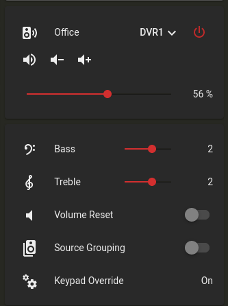

# nuvo_simple
Home Assistant custom component integration to control the basic Nuvo whole home amplifiers using a serial (RS232) connection.

Currently supports Concerto, Essentia D, and Simplese (untested).

For the Grand Concerto / Essentia G see sproket-9's integration [nuvo_serial](https://raw.githubusercontent.com/sprocket-9/hacs-nuvo-serial)

Portions derived from code published by ejonesnospam.

## What this Integration does:

Creates Home Assistant Entities for each zone allowing control through Home Assistant.

#### Media Player Entity:
* On/Off
* Volume
* Mute
* Source selection

#### Number Entities:
* Bass control
* Treble control
* Balance control (Concerto only)
* Volume offset (for speaker groups)

#### Switch Entities:
* Source Grouping (Essentia and Simplese only)
* Keypad Lock (Essentia and Simplese only)
* Volume Reset (Essentia only)

#### Binary_sensor Entity:
* Keypad DIP switch override (Essentia only)

#### Services:
* Paging On (nuvo_simple.paging_on)
* Paging Off (nuvo_simple.paging_off)
* Mute All Zones (nuvo_simple.mute_all)
* Unmute All Zones (nuvo_simple.unmute_all)
* All Zones Off (nuvo_simple.all_off)

##### Speaker group management:
The media player entities support join/unjoin to make speaker groups.  This has only been tested using the Mini Media Player, but ideally should support other methods as well.

* Each entity is it's own master.  
* There is an extra zone called "Group Controller", essentially zone 0, or a "virtual zone."
* Any zone/entity can be added to the Group Controller if keypad control is not needed/desired.
* Any zone/entity can only be added to another group once.  Adding it to the second group removes it from the first.
* Zone/entity can not have it's own group members if it's a slave in another group.
* Volume Offset controls the offset in that zone/entity if it is a slave in a group.
* Volume Offset is percentage of total volume.

** If you are not using the zone expander or have extra unused zones, these keypads can still be used!  This is very nice if you do not have the expander, or just have an unused zone.  Simply setup a keypad for zone 7-12 and assign it in the configuration file.  Then you can essentially have a keypad that is the same as the "Group Controller."

##### Paging service:
These Nuvos do not natively support a page function, however you can configure a paging zone and volume levels for the service to switch the amp over to.  Calling the off service restores all zones to their previous state.

##### All Off Recall:
If this is enabled, pressing the All Off button on the keypad a second time after all zones have been turned off will turn back on the previously turned off zones.  This works with the keypad only.

## Known issues:

Paging service turns on the last played zone for a small amount of time.  The Nuvo does not allow source changes when powered down, and even when powering on, will not accept a source change for a very short amount of time.  Therefore, if the last zone playing was zone 1, for example, and your paging zone is 6, zone 1 will play for a fraction of a second when the Paging on service is called until the Nuvo can be switched to the paging zone.  I don't see a way around this.

Keypad lock does not know if the keypad is locked upon startup as there is no way to query the current status from the Nuvo.

## Connecting to the Nuvo:
Connection to the Nuvo is by an RS232 serial port from the host running Home Assistant to the amplifier's serial port, either by using a USB to RS232 converter, or by using a RS232 port directly on the host.  If using a USB to RS232 converter, I would recommend using the full name instead of "/dev/ttyUSB0" as if you have more than one serial port that device can change.  You can find the full name by looking in /dev/serial/by-id.  For instance, "/dev/serial/by-id/usb-Prolific_Technology_Inc._USB-Serial_Controller_D-if00-port0".

## Installing:

[](https://github.com/hacs/integration)

Install using the Home Assistant Community Store [HACS](https://hacs.xyz).

Once HACS is installed, go to the Integrations page and select the menu in the upper right hand corner and choose "Custom Repositories."

In the repository field, enter: https://github.com/brmccrary/nuvo_simple

In the Category field, select Integration. 

The integration will now show up as nuvo_simple under integrations inside HACS.  Click on it and Download.
 
## Configuration:

Configuration must be done through configuration.yaml, no GUI option is available for now.

Example:
~~~
nuvo_simple:
  port: /dev/serial/by-id/usb-Prolific_Technology_Inc._USB-Serial_Controller_D-if00-port0
  baud: 9600          # Optional, defaults to 9600
  page_source: 6      # Optional, defaults to source 6
  page_volume: 35     # Optional, defaults to 35%.  Volume is in percentage.  0 is muted and 100 is loudest.
  min_offset: -20     # Optional, minimum volume offset percentage for offset number entity.  Defaults to -20
  max_offset: 20      # Optional, maximum volume offset percentage for offset number entity.  Defaults to 20
  all_off_recall: yes # Optional, enables "all off recall."  Defaults to no.
  zones:
    1:
      name: Office
    2:
      name: Very Noisy Room
      zone_page_volume: 95  # Optional, if specified will override page_volume above for that zone only.
  sources:
    1:
      name: SiriusXM
    2:
      name: Chromecast Audio
~~~
## How to use when the serial port is on another machine:

You can use the program ncat, available on most Linux distros, as a way to access the Nuvo across the LAN if it's on a different machine.
Here is an example of how to set this up, using port 59001 as the connection port.  Feel free to change to meet your individual needs.

After installing ncat, create a file /usr/local/bin/nuvonet with the following, putting your actual serial port device in the PORT setting:
~~~
#!/bin/bash
export PORT=<your serial port goes here>
stty -F $PORT cs8 -cstopb -parenb -crtscts raw 9600
ncat --listen --keep-open 59001 < $PORT > $PORT
~~~
Make it executable by running:
~~~
chmod 755 /usr/local/bin/nuvonet
~~~
If using systemd, you can make it start automatically by making a file in /etc/systemd/system/nuvonet.service
~~~
# systemd configuration for nuvonet.service

[Unit]
Description=Nuvo Serial to Network
Requires=time-sync.target
After=time-sync.target

StartLimitIntervalSec=100
StartLimitBurst=5

[Service]
ExecStart=/usr/local/bin/nuvonet
ExecReload=/bin/kill -HUP $MAINPID
Type=simple

Restart=on-failure
RestartSec=60

[Install]
WantedBy=multi-user.target
~~~
Run the following to start the new "nuvonet" service:
~~~
systemctl enable nuvonet
systemctl start nuvonet
~~~
Change the port setting in configuration.yaml to:
~~~
port: socket://<yournuvohost>:59001
~~~

**IMPORTANT**  This has no security at all, so anyone could connect, in this case, to port 59001 and control your Nuvo.  Do not expose this port to the outside.  

## Troubleshooting:

Add the following to configuration.yaml to enable debugging:
~~~
logger:
  default: warn # Put your normal logging level that you use here.
  logs:
    custom_components.nuvo_simple: debug
    nuvo_simple: debug
~~~

## Lovelace Frontend Configuration
I really liked the way [sproket-9](https://github.com/sprocket-9) created the idea of using the [mini-media-player](https://github.com/kalkih/mini-media-player) and I think it works great for the "simple" Nuvo amps as well.  Here is his example, except I only added one zone, but this should be enough to get someone started:

Everything in this section is optional and shows a heavily opinionated method of configuring Lovelace to display the Nuvo entities.  While it may not be to everyones taste, it should at least give some inspiration for configuration possibilites.

The core [Media Player](https://www.home-assistant.io/integrations/media_player/) integration (and therefore any Lovelace media control card representing a media player entity) does not provide a way to control a media device's EQ settings.  Each EQ setting is modeled using the [Number](https://www.home-assistant.io/integrations/number/) integration.  The advantage of this is the ability to use the native number ranges exposed by the Nuvo for each control rather than a card showing a generic 0-X scale.

While Home Assistant will auto-create Lovelace media control and number cards for each Nuvo entity, a more polished look can be achieved using third-party cards [mini-media-player](https://github.com/kalkih/mini-media-player) and [lovelace-slider-entity-row](https://github.com/thomasloven/lovelace-slider-entity-row), both cards are installable through [HACS](https://hacs.xyz).

This example Lovelace configuration displays the EQ settings in a [Conditional](https://www.home-assistant.io/lovelace/conditional/) card that is only displayed when the zone is switched on and an input_boolean entity is True.  This input_boolean is toggled by tapping the mini-media-player representing the zone.  In order to achieve this, an additional input_boolean entity per-zone needs manually created (it's purely to control the frontend EQ Conditional card, it doesn't represent anything on the Nuvo itself).

e.g. In configuration.yaml:

```yaml
input_boolean:
  eq_office:
    name: Office EQ
    initial: off
```

Will create the entity:
```
input_boolean.eq_office
```

As shown the yaml section below, the [tap action](https://github.com/kalkih/mini-media-player#action-object-options) on each mini-media-player will call the input_boolean.toggle service.

Example section of code in a Vertical Stack Card:

```yaml
type: vertical-stack
cards:
  - type: entities
    entities:
      - type: custom:mini-media-player
        entity: media_player.office
        volume_stateless: true
        group: true
        hide:
          controls: false
          info: false
          power_state: false
          play_pause: true
          prev: true
          next: true
        speaker_group:
          platform: media_player
          show_group_count: true
          entities:
            - entity_id: media_player.computer_room
              name: CR
            - entity_id: media_player.lower_hallway
              name: Lower Hall
            - entity_id: media_player.upper_hallway
              name: Upper Hall
        icon: mdi:speaker-wireless
        tap_action:
          action: call-service
          service: input_boolean.toggle
          service_data:
            entity_id: input_boolean.eq_office
      - type: custom:slider-entity-row
        entity: media_player.office
        full_row: true
        step: 1
        hide_state: false
        hide_when_off: true
  - type: conditional
    conditions:
      - entity: media_player.office
        state: 'on'
      - entity: input_boolean.eq_office
        state: 'on'
    card:
      type: entities
      entities:
        - type: custom:slider-entity-row
          entity: number.office_bass
          name: Bass
          icon: mdi:music-clef-bass
          hide_state: false
          hide_when_off: true
          full_row: false
        - type: custom:slider-entity-row
          entity: number.office_treble
          full_row: false
          name: Treble
          icon: mdi:music-clef-treble
          hide_state: false
          hide_when_off: true
        - type: custom:slider-entity-row
          entity: number.office_volume_offset
          name: Offset
          icon: mdi:volume-equal
          full_row: false
          hide_state: false
          hide_when_off: true
        - entity: switch.office_volume_reset
          name: Volume Reset
          icon: mdi:volume-low
          show_state: true
        - entity: switch.office_source_group
          name: Source Grouping
          icon: mdi:speaker-multiple
          show_state: true
        - entity: switch.office_keypad_lock
          name: Keypad Lock
          icon: mdi:lock
          show_state: true
        - entity: binary_sensor.office_override
          name: Keypad Override
          icon: mdi:cogs
          show_state: true
```
This configuration will display the card below (except with your own theme, which is probably different than mine), with the EQ settings card toggled by tapping on the media player, in any area not containing a control:


